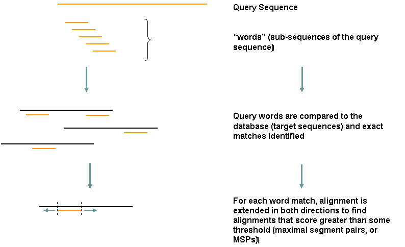

# Introduction to BLAST 

by *alper yilmaz* for *GTU Bioinformatics Program Course*

*2019-03-14* (PDF version of this document is accessible at `goo.gl/bhrkqQ` and html version is available at `https://goo.gl/siUoax`)

<!-- long url is https://s3-us-west-2.amazonaws.com/veri-analizi/BLAST-outline.pdf -->

<!-- TODO : html version need dataurlify utility -->

[TOC]


## Paralog vs. Homolog


[image source](https://bitesizebio.com/26762/homology-terminology-never-say-wrong-word/)

## Local vs. Global Alignment


| Global Sequence Alignment                                    | Local  Sequence Alignment                                    |
| :----------------------------------------------------------- | ------------------------------------------------------------ |
| In global alignment, an attempt is made to align the entire sequence (end to end alignment) | Finds local regions with the highest level of similarity between the two sequences. |
| A global alignment contains all letters from both the query and target sequences | A local alignment aligns a substring of the query sequence to a substring of the target sequence. |
| If two sequences have approximately the same length and are quite similar, they are suitable for global alignment. | Any two sequences can be locally aligned as local alignment finds  stretches of sequences with high level of matches without  considering the alignment of rest of the sequence regions. |
| Suitable for aligning two closely related sequences.         | Suitable for aligning more divergent sequences or distantly related sequences. |
| Global alignments are usually done for comparing homologous genes like comparing two genes with same function (in human vs. mouse) or comparing two proteins with similar function. | Used for finding out conserved patterns in DNA sequences or conserved domains or motifs in two proteins. |
| A general global alignment technique is the Needleman–Wunsch algorithm. | A general local alignment method is Smith–Waterman algorithm. |


[image and table source](https://www.majordifferences.com/2016/05/difference-between-global-and-local.html)

## BLAST

* **B**asic **L**ocal **A**lignment **S**earch **T**ool
* http://blast.ncbi.nlm.nih.gov/
* Are there sequences in databases/databanks similar to my sequence?

**Functions of BLAST**

* Identify species
* Locating domains
* Establishing phylogeny
* Comparison

## The Index


## Types of BLAST programs


[image source](http://library.open.oregonstate.edu/computationalbiology/chapter/command-line-blast/)

## How BLAST works



[image source](https://www.integratedbreeding.net/courses/genomics-and-comparative-genomics/www.generationcp.org/genomics/index257b.html?page=1174)


[image source](http://130.88.97.239/ember/prototype/CHAPTER02/INFORMATION.shtml)

## Scoring

### Nucleotide


[image source](https://www.ncbi.nlm.nih.gov/Class/MLACourse/Modules/BLAST/scoring_nucleotides.html)

### Alignment score

```
AACGTTTCCAGTCCAAATAGCTAGGC
===--===   =-===-==-======
AACCGTTC   TACAATTACCTAGGC

Hits(+1): 18
Misses (-2): 5
Gaps (existence -2, extension -1): 1 Length: 3
Score = 18 * 1 + 5 * (-2) – 2 – 2 = 4
```

### Amino Acid

BLOSUM62 Substitution Matrix


[image source](https://memim.com/blosum.html)
