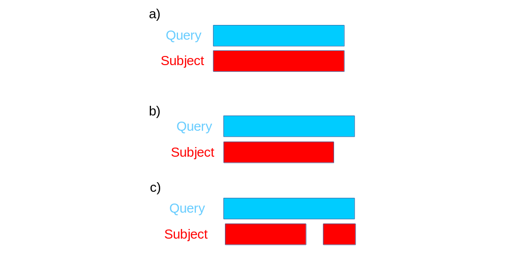
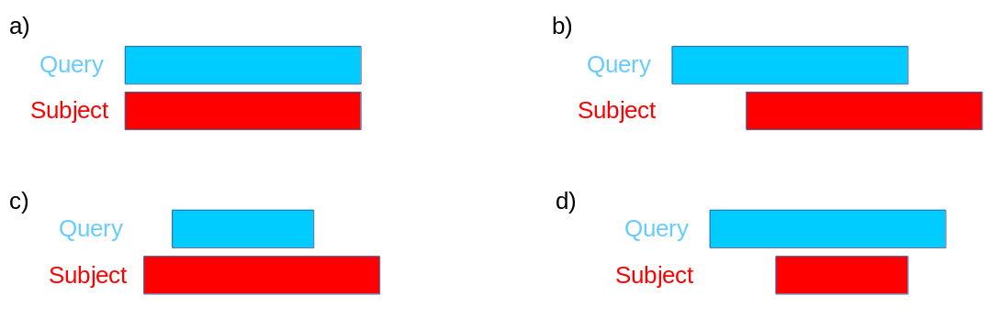

# Web BLAST exercises

by *alper yilmaz* for *GTU Bioinformatics Program Course*

*2019-03-14* (PDF version of this document is accessible at `goo.gl/bhrkqQ` and html version is available at `https://goo.gl/siUoax`)


> Please go over  [Guide to BLAST home and search pages](ftp://ftp.ncbi.nlm.nih.gov/pub/factsheets/HowTo_BLASTGuide.pdf) and [BLAST Report description](ftp://ftp.ncbi.nlm.nih.gov/pub/factsheets/HowTo_NewBLAST.pdf) guides before proceeding with exercises.

## Question1

If we align A and B (sequences are provided below) what would be the layout of the alignment?



Sequence for A

```
>A
AGCTTTTCATTCTGACTGCAACGGGCAATATGTCTCTGTGTGGATTAAAAAAAGAGTGTCTGATAGCAGCTTCTGAACTG
GTTACCTGCCGTGAGTAAATTAAAATTTTATTGACTTAGGTCACTAAATACTTTAACCAATATAGGCATAGCGCACAGAC
AGATAAAAATTACAGAGTACACAACATCCATGAAACGCATTAGCACCACCATTACCACCACCATCACCATTACCACAGGT
AACGGTGCGGGCTGACGCGTACAGGAAACACAGAAAAAAGCCCGCACCTGACAGTGCGGGCTTTTTTTTTCGACCAAAGG
TAACGAGGTAACAACCATGCGAGTGTTGAAGTTCGGCGGTACATCAGTGGCAAATGCAGAACGTTTTCTGCGTGTTGCCG
ATATTCTGGAAAGCAATGCCAGGCAGGGGCAGGTGGCCACCGTCCTCTCTGCCCCCGCCAAAATCACCAACCACCTGGTG
GCGATGATTGAAAAAACCATTAGCGGCCAGGATGCTTTACCCAATATCAGCGATGCCGAACGTATTTTTGCCGAACTTTT
GACGGGACTCGCCGCCGCCCAGCCGGGGTTCCCGCTGGCGCAATTGAAAACTTTCGTCGATCAGGAATTTGCCCAAATAA
AACATGTCCTGCATGGCATTAGTTTGTTGGGGCAGTGCCCGGATAGCATCAACGCTGCGCTGATTTGCCGTGGCGAGAAA
ATGTCGATCGCCATTATGGCCGGCGTATTAGAAGCGCGCGGTCACAACGTTACTGTTATCGATCCGGTCGAAAAACTGCT
GGCAGTGGGGCATTACCTCGAATCTACCGTCGATATTGCTGAGTCCACCCGCCGTATTGCGGCAAGCCGCATTCCGGCTG
ATCACATGGTGCTGATGGCAGGTTTCACCGCCGGTAATGAAAAAGGCGAACTGGTGGTGCTTGGACGCAACGGTTCCGAC
TACTCTGCTGCGGTGCTGGCTGCCTGTTTACGCGCCGATTGTTGCGAGATTTGGACGGACGTTGACGGGGTCTATACCTG
CGACCCGCGTCAGGTGCCCGATGCGAGGTTGTTGAAGTCGATGTCCTACCAGGAAGCGATGGAGCTTTCCTACTTCGGCG
CTAAAGTTCTTCACCCCCGCACCATTACCCCCATCGCCCAGTTCCAGATCCCTTGCCTGATTAAAAATACCGGAAATCCT
CAAGCACCAGGTACGCTCATTGGTGCCAGCCGTGATGAAGACGAATTACCGGTCAAGGGCATTTCCAATCTGAATAACAT
GGCAATGTTCAGCGTTTCTGGTCCGGGGATGAAAGGGATGGTCGGCATGGCGGCGCGCGTCTTTGCAGCGATGTCACGCG
CCCGTATTTCCGTGGTGCTGATTACGCAATCATCTTCCGAATACAGCATCAGTTTCTGCGTTCCACAAAGCGACTGTGTG
CGAGCTGAACGGGCAATGCAGGAAGAGTTCTACCTGGAACTGAAAGAAGGCTTACTGGAG
```

<div style="page-break-after: always;"></div>

Sequence for B

```
>B
AGCTTTTCATTCTGACTGCAACGGGCAATATGTCTCTGTGTGGATTAAAAAAAGAGTGTCTGATAGCAGCTTCTGAACTG
GTTACCTGCCGTGAGTAAATTAAAATTTTATTGACTTAGGTCACTAAATACTTTAACCAATATAGGCATAGCGCACAGAC
AGATAAAAATTACAGAGTACACAACATCCATGAAACGCATTAGCACCACCATTACCACCACCATCACCATTACCACAGGT
AACGGTGCGGGCTGACGCGTACAGGAAACACAGAAAAAAGCCCGCACCTGACAGTGCGGGCTTTTTTTTTCGACCAAAGG
TAACGAGGTAACAACCATGCGAGTGTTGAAGTTCGGCGGTACATCAGTGGCAAATGCAGAACGTTTTCTGCGTGTTGCCG
ATATTCTGGAAAGCAATGCCAGGCAGGGGCAGGTGGCCACCGTCCTCTCTGCCCCCGCCAAAATCACCAACCACCTGGTG
GCGATGATTGAAAAAACCATTAGCGGCCAGGATGCTTTACCCAATATCAGCGATGCCGAACGTATTTTTGCCGAACTTTT
GACGGGACTCGCCGCCGCCCAGCCGGGGTTCCCGCTGGCGCAATTGAAAACTTTCGTCGATCAGGAATTTGCCCAAATAA
AACATGTCCTGCATGGCATTAGTTTGTTGGGGCAGTGCCCGGATAGCATCAACGCTGCGCTGATTTGCCGTGGCGAGAAA
ATGTCGATCGCCATTATGGCCGGCGTATTAGAAGCGCGCGGTCACAACGTTACTGTTATCTACTCTGCTGCGGTGCTGGC
TGCCTGTTTACGCGCCGATTGTTGCGAGATTTGGACGGACGTTGACGGGGTCTATACCTGCGACCCGCGTCAGGTGCCCG
ATGCGAGGTTGTTGAAGTCGATGTCCTACCAGGAAGCGATGGAGCTTTCCTACTTCGGCGCTAAAGTTCTTCACCCCCGC
ACCATTACCCCCATCGCCCAGTTCCAGATCCCTTGCCTGATTAAAAATACCGGAAATCCTCAAGCACCAGGTACGCTCAT
TGGTGCCAGCCGTGATGAAGACGAATTACCGGTCAAGGGCATTTCCAATCTGAATAACATGGCAATGTTCAGCGTTTCTG
GTCCGGGGATGAAAGGGATGGTCGGCATGGCGGCGCGCGTCTTTGCAGCGATGTCACGCGCCCGTATTTCCGTGGTGCTG
ATTACGCAATCATCTTCCGAATACAGCATCAGTTTCTGCGTTCCACAAAGCGACTGTGTGCGAGCTGAACGGGCAATGCA
GGAAGAGTTCTACCTGGAAC
```

<!-- answer: c -->

## Question2

In which cases *query coverage* is 100% (more than one correct answer is accepted)



<!-- answer: a and c -->

<div style="page-break-after: always;"></div>

## Question3

The sequence below is used in the book "*Jurassic Park THE LOST WORLD*". Please use blastx to find the hidden message. (Hint: unaligned sequences)

```
>DinoDNA from THE LOST WORLD p. 135
GAATTCCGGAAGCGAGCAAGAGATAAGTCCTGGCATCAGATACAGTTGGAGATAAGGACGGACGTGTGGCAGCTCCCGCA
GAGGATTCACTGGAAGTGCATTACCTATCCCATGGGAGCCATGGAGTTCGTGGCGCTGGGGGGGCCGGATGCGGGCTCCC
CCACTCCGTTCCCTGATGAAGCCGGAGCCTTCCTGGGGCTGGGGGGGGGCGAGAGGACGGAGGCGGGGGGGCTGCTGGCC
TCCTACCCCCCCTCAGGCCGCGTGTCCCTGGTGCCGTGGGCAGACACGGGTACTTTGGGGACCCCCCAGTGGGTGCCGCC
CGCCACCCAAATGGAGCCCCCCCACTACCTGGAGCTGCTGCAACCCCCCCGGGGCAGCCCCCCCCATCCCTCCTCCGGGC
CCCTACTGCCACTCAGCAGCGGGCCCCCACCCTGCGAGGCCCGTGAGTGCGTCATGGCCAGGAAGAACTGCGGAGCGACG
GCAACGCCGCTGTGGCGCCGGGACGGCACCGGGCATTACCTGTGCAACTGGGCCTCAGCCTGCGGGCTCTACCACCGCCT
CAACGGCCAGAACCGCCCGCTCATCCGCCCCAAAAAGCGCCTGCTGGTGAGTAAGCGCGCAGGCACAGTGTGCAGCCACG
AGCGTGAAAACTGCCAGACATCCACCACCACTCTGTGGCGTCGCAGCCCCATGGGGGACCCCGTCTGCAACAACATTCAC
GCCTGCGGCCTCTACTACAAACTGCACCAAGTGAACCGCCCCCTCACGATGCGCAAAGACGGAATCCAAACCCGAAACCG
CAAAGTTTCCTCCAAGGGTAAAAAGCGGCGCCCCCCGGGGGGGGGAAACCCCTCCGCCACCGCGGGAGGGGGCGCTCCTA
TGGGGGGAGGGGGGGACCCCTCTATGCCCCCCCCGCCGCCCCCCCCGGCCGCCGCCCCCCCTCAAAGCGACGCTCTGTAC
GCTCTCGGCCCCGTGGTCCTTTCGGGCCATTTTCTGCCCTTTGGAAACTCCGGAGGGTTTTTTGGGGGGGGGGCGGGGGG
TTACACGGCCCCCCCGGGGCTGAGCCCGCAGATTTAAATAATAACTCTGACGTGGGCAAGTGGGCCTTGCTGAGAAGACA
GTGTAACATAATAATTTGCACCTCGGCAATTGCAGAGGGTCGATCTCCACTTTGGACACAACAGGGCTACTCGGTAGGAC
CAGATAAGCACTTTGCTCCCTGGACTGAAAAAGAAAGGATTTATCTGTTTGCTTCTTGCTGACAAATCCCTGTGAAAGGT
AAAAGTCGGACACAGCAATCGATTATTTCTCGCCTGTGTGAAATTACTGTGAATATTGTAAATATATATATATATATATA
TATATCTGTATAGAACAGCCTCGGAGGCGGCATGGACCCAGCGTAGATCATGCTGGATTTGTACTGCCGGAATTC
```

## Question4

The peptide sequence below is translation of 4th exon of a Drosophilia gene. Use blastp and swissprot index to find out gene name.

```
MSLTVEIVATKPYEGQKPGTSGLRKKVKVFTQPNYTENFVQAILEANGAALAGSTLVVGGDGRFYCKEAAELIVRLSAAN
GVSKLLVGQNGILSTPAVSSLIRHNKALGGIVLTASHNPGGPENDFGIKFNCENGGPAPDAFTNHIYKITTEIKEYKLVR
NLQIDISKVGVTSFDIAGKPFTVEVIDSVANYVRHMEEIFDFAKLKDFVSGKATGKPLKMRIDAMNGVTGSYVREIFLNR
LGATESSVVHTTPLPDFGGLHPDPNLTYAKDLVDTVAQGDYDIGAAFDGDGDRNMIIGSKAFFVTPSDSLAVIAHYLEAI
PYFQKNGVQGFARSMPTASAVDLVGRKLGKEVFEVPTGWKYFGNLMDAGRLCLCGEESFGTGSNHIREKDGIWAVLAWIS
VMQHTGKGIEDILKQHWSVYGRNYFTRYDYEECASDPCNEMVATMEKTITAPEFVGKSYSSGGKTYKVKEADNFSYTDPV
DKSVATKQGLRIVFEDGSRIVVRLSGTGSSGATVRLYIDSYEKENVLGQASVMLKPLIDIALEISQLPKFTGRNAPTVIT
```

<!-- PGM1(Phosphoglucomutase) -->

<div style="page-break-after: always;"></div>

## Question5

Below is the sequence of a HIV protein, please find out at which codon (nucleotide coordinate) the frameshift had taken place.

```
ATGAGAGTGAAGGAGAAATATCAGCACTTGTGGAGATGGGGCACCATGCTCCTTGGGTTGTTGATGATCCGTAGTGCTGC
AGACCAATTGTGGGTCACAGTCTATTATGGGGTACCTGTGTGGAAAGAAGCAACCACCACTCCATTTTGTGCATCAGATG
CTAAAGCATATGATACAGAGGTACATAATGTTTGGGCCACACACGCCTGTGTACCCACAGACCCCAACCCACAAGAAGTA
GTATTGGCAAATGTGGCAGAAAATTTTAACATGTGGGATAATAACATGGTAGAACAGATGCATGAGGATATAATCAGTTT
ATGGGATCAAAGCCTAAAGCCATGTGTTAAATTAACCCCACTCTGTGTTACTTTAAACTGCACTGATAAGATTAATAATA
CCAAAACTACTCCTAATAATACCAGTACTACTCCCCCTACCACTGTTACTCCTACTAGTAATAGCAGCATGACAGGAGAA
GGAGAAATAAAAAACTGCTCTTTCAATATCACCACAGCCATAAGAGATAAGGTGCAGAGAGGATATGCATTGTTTAGTAA
ACTTTGATATAGTACCAATAGATAATGATAGAAATGATAGTACCAGCTATAGGTTGCTAAGTTGTAACACCTCAGTCATT
ACACAAGCCTGTCCAAAGGTATCCTTTGAACCAATTCCCATACATTATTGTGCCCCAGCTGGTTTTGCGATTCTAAAGTG
TAACAATAAGACGTTCAGTGGAACAGGACCCTGTACAAATGTCAGCACAGTACAATGTACACATGGAATTAGGCCAATAG
TATCAACTCAACTGCTGTTAAATGGCAGTCTAGCAGAAGAAGGGATAGTAATTAGATATGAAAATATCACAGACAATGCT
AAAAGCATAATAATACAGCTGAATGAAACTGTACAAATTAATTGTACAAGACCCAACAATAATACAAGGAAAAGTATACC
TATAGGACCAGGAAGAGCATTTTATGCAACAGGAGATATAATAGGAGATATAAGAAAAGCATATTGTAACATTAGTGGAG
CAAAATGGAATAACACTTTAAAAAGGATAGCTTACAAATTAAAAGAACAATTTCCTAATAAAACAATAGTCTTTAAGCCC
TCCTCAGGAGGGGACCCAGAAATTGTAATGCACAGTTTTAATTGTAGAGGGGAATTTTTCTACTGTAATACAACAAAACT
GTTTGATAGTAGTTGGGATAATACTAATTTGAATAAAACTTGGAATAATACCTGGAATAAAAATAACTCTATCATACTTC
CATGCAGAATAAAACAAATCATAAACATGTGGCAGGAAGTAGGAAAAGCAATGTATGCCCCTCCCATCGAAGGACCACTT
TACTGTTTATCAAATATTACAGGGCTAATTTTAACAAGAGATGGTGGGAACGAAACTGATGGGAACAACACTGATGGGAA
TGAGACCTTCAGACCTGGAGGAGGGAATATGAGGGACAATTGGA
```

<!-- 564 -->

## Question6

Following sequence ([source](https://www.ncbi.nlm.nih.gov/Class/BLAST/blast_course.html)) belongs to a *C.elegans* gene. Please find its homologs in vertebrates. (Hint: use taxonomy report in results) 

```
>C.elegans protein
MFHPGMTSQPSTSNQMYYDPLYGAEQIVQCNPMDYHQANILCGMQYFNNSHNRYPLLPQMPPQFTNDHPYDFPNVPTIST
LDEASSFNGFLIPSQPSSYNNNNISCVFTPTPCTSSQASSQPPPTPTVNPTPIPPNAGAVLTTAMDSCQQISHVLQCYQQ
GGEDSDFVRKAIESLVKKLKDKRIELDALITAVTSNGKQPTGCVTIQRSLDGRLQVAGRKGVPHVVYARIWRWPKVSKNE
LVKLVQCQTSSDHPDNICINPYHYERVVSNRITSADQSLHVENSPMKSEYLGDAGVIDSCSDWPNTPPDNNFNGGFAPDQ
PQLVTPIISDIPIDLNQIYVPTPPQLLDNWCSIIYYELDTPIGETFKVSARDHGKVIVDGGMDPHGENEGRLCLGALSNV
HRTEASEKARIHIGRGVELTAHADGNISITSNCKIFVRSGYLDYTHGSEYSSKAHRFTPNESSFTVFDIRWAYMQMLRRS
RSSNEAVRAQAAAVAGYAPMSVMPAIMPDSGVDRMRRDFCTIAISFVKAWGDVYQRKTIKETPCWIEVTLHRPLQILDQL
LKNSSQFGSS
```