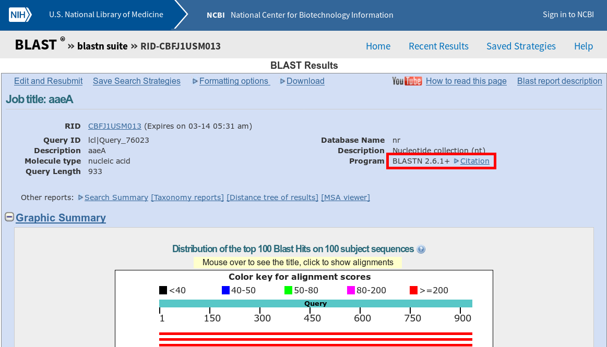
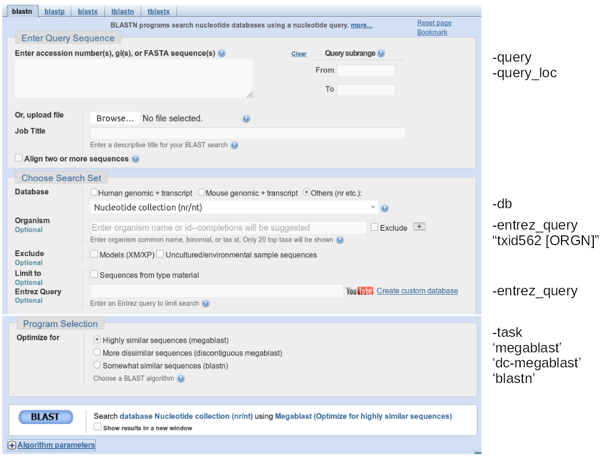
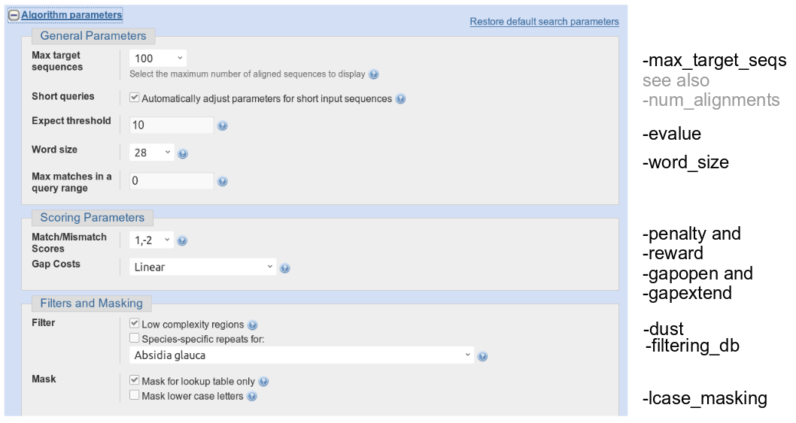
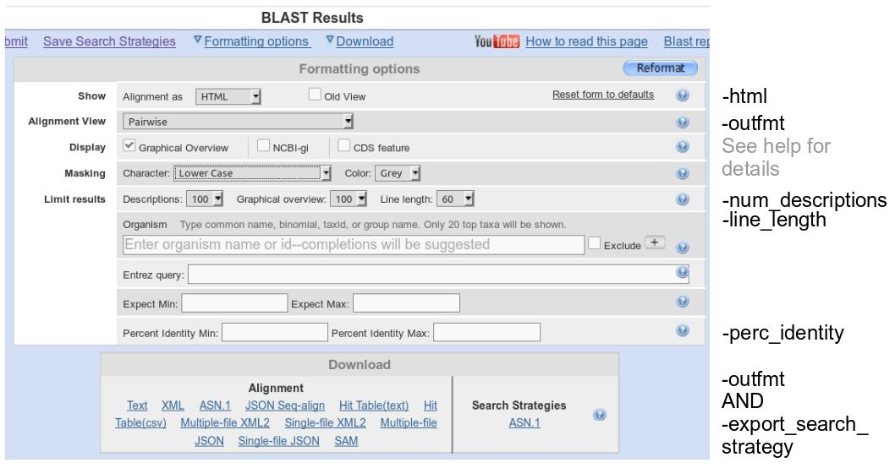
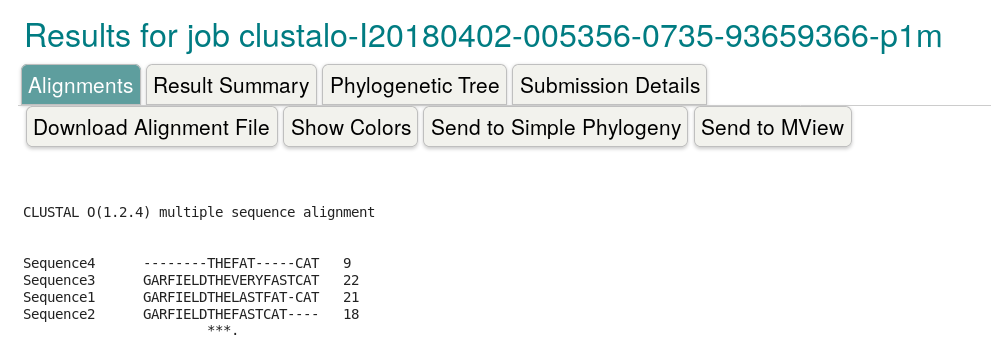
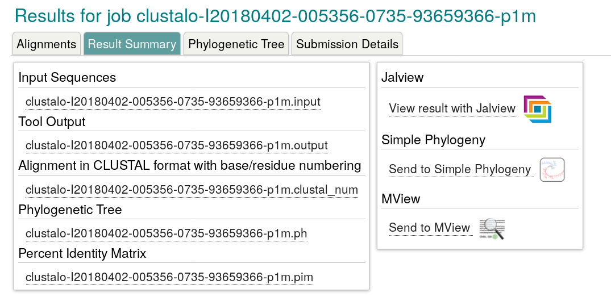
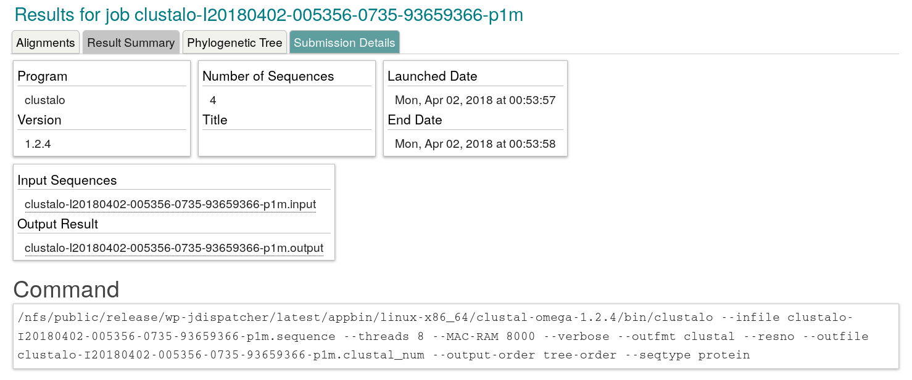

# BLAST (in Linux terminal)

by *alper yilmaz* for *GTU Bioinformatics Program Course*

*2019-03-14* (PDF version of this document is accessible at `goo.gl/bhrkqQ` and html version is available at `https://goo.gl/siUoax`)

<!-- long url is https://s3-us-west-2.amazonaws.com/veri-analizi/BLAST-outline.pdf -->

<!-- TODO : html version need dataurlify utility -->

[TOC]


**Instructions:** 

* If you are viewing  this document in JupyterLab environment, you can edit and run commands in cells. You can use `Ctrl+Enter` keyboard shortcut to run a cell. Normally the code is run in Python kernel but if the code has preceding `!` then it's run in terminal. Also, JupyterLab environment provides actual terminal access. Under `File` menu go to `New` option and choose `Terminal`. 

- To exercise terminal commands, please register an account at [Docker Cloud](https://cloud.docker.com/) and log in to [Play With Docker](https://labs.play-with-docker.com/) site with your Docker ID. Then, click `Add New Instance` and type the following command in terminal window `docker run -it alperyilmaz/blast-course`
- Alternative access: Windows users should download and use Putty software to connect remote server in order to run the commands. The IP address is **will be provided during or right after class** and you should have your usernames provided. Linux users or Windows users with cygwin installed in their system should use `ssh` for connection.
- Any command starting with dollar sign '\$', such as: `$ blastn -db Ecoli_cds -query test.fa` can be copied and pasted to terminal **without the dollar sign** and executed. Please exercise how to paste text to Putty window before hand (the middle click trick) in order to have better experience.


# Running BLAST

## Interfaces of Blast

- Web (Howto Guide link)
  - No installation (both software and index)
  - Suitable for small jobs
  - Output is in HTML (links to resulting sequences)
- Web service (REST or programmatic access)
  - Usually an app or software uses this channel to query and retrieve results ([details](https://blast.ncbi.nlm.nih.gov/Blast.cgi?CMD=Web&PAGE_TYPE=BlastDocs&DOC_TYPE=DeveloperInfo)) ([sample code](https://blast.ncbi.nlm.nih.gov/docs/web_blast.pl))
- Commandline
  - Needs terminal access (which rocks ;)
  - Needs installation of [executable](ftp://ftp.ncbi.nlm.nih.gov/blast/executables/blast+/LATEST/) and preparation of indexes
  - No limit in job size
  - No need to wait for queue
  - Scriptable *(can easily be part of a pipeline or automated script)*


> Web BLAST  is actually the commandline BLAST running in server.  Web BLAST is running BLAST version 2.6.1+ (see below) and the commandline BLAST is running 2.6.0+ version (see `blastn -h` output below). 
>
> Web BLAST is configured so that the input and arguments are retrieved from HTML form filledin by user and the results are sent to user in HTML format. In commandline version, the user provides an actual file as input and gets an actual file as output.
>
> 


## BLAST in commandline

### Resources for Linux commandline introduction

The concept of commandline and Linux operating system itself might be a new concept to most of us. Thus, couple of the resources below might orient you for this new concept.

- For brief introduction to Linux commandline please go over the [presentation](https://community.gep.wustl.edu/repository/course_materials_WU/learning_unix/UNIX_BLAST_RepeatMasker.pdf) prepared by Christopher Shaffer at Washington University. 

- Check out BLAST in commandline [presentation](https://drive.google.com/file/d/0BzYD0PMQheByTUtaVlNEVUhkYk0/edit) by Andrew Alverson. 

- A single page of [Linux cheat sheet](http://sites.tufts.edu/cbi/files/2013/01/linux_cheat_sheet.pdf) might give you an idea of important commands.

  

### How to run BLAST in commandline

- a short example

  ```
  $ blastn -db Ecoli_cds -query test.fa
  ```

- an advanced example (looping through all output options - **no single click involved**)

  ```
  $ for i in {0..12}; do blastn -db customdb -query test.fa -outfmt $i -out custom-format"$i".out; done
  ```


## BLAST index sources

- NCBI indexes
  - can be [downloaded](ftp://ftp.ncbi.nlm.nih.gov/blast/db/) and updated regularly (local Blast, works offline)
    - `nr` content is around 27 GB (compressed) and `nt` content is around 36 GB (compressed)
    - whole BLAST in *your own computer*!
  - accessed remotely by `-remote` option in terminal (remote Blast)
    - sequences are sent to Blast web server for search (needs internet connection)
    - then why not just use the web version? Scriptable, remember!
- Custom index (local Blast, works offline)
  - You can prepare a custom Fasta file and then index it. After that you can Blast many sequences against your custom index.

> Note: Beware that `nr` or `nt` database contains ALL sequences in non-redundant fashion. It includes mRNA sequences as well as genome files. So, if you BLAST a gene sequence to `nr` you'd get too many hits due to chromosome, partial chromosome, contigs, etc. results.

## Commandline arguments

The BLAST software has overwhelming number of arguments (shown below)

```
$ blastn -h
USAGE
  blastn [-h] [-help] [-import_search_strategy filename]
    [-export_search_strategy filename] [-task task_name] [-db database_name]
    [-dbsize num_letters] [-gilist filename] [-seqidlist filename]
    [-negative_gilist filename] [-entrez_query entrez_query]
    [-db_soft_mask filtering_algorithm] [-db_hard_mask filtering_algorithm]
    [-subject subject_input_file] [-subject_loc range] [-query input_file]
    [-out output_file] [-evalue evalue] [-word_size int_value]
    [-gapopen open_penalty] [-gapextend extend_penalty]
    [-perc_identity float_value] [-qcov_hsp_perc float_value]
    [-xdrop_ungap float_value] [-xdrop_gap float_value]
    [-xdrop_gap_final float_value] [-searchsp int_value] [-max_hsps int_value]
    [-sum_stats bool_value] [-penalty penalty] [-reward reward] [-no_greedy]
    [-min_raw_gapped_score int_value] [-template_type type]
    [-template_length int_value] [-dust DUST_options]
    [-filtering_db filtering_database]
    [-window_masker_taxid window_masker_taxid]
    [-window_masker_db window_masker_db] [-soft_masking soft_masking]
    [-ungapped] [-culling_limit int_value] [-best_hit_overhang float_value]
    [-best_hit_score_edge float_value] [-window_size int_value]
    [-off_diagonal_range int_value] [-use_index boolean] [-index_name string]
    [-lcase_masking] [-query_loc range] [-strand strand] [-parse_deflines]
    [-outfmt format] [-show_gis] [-num_descriptions int_value]
    [-num_alignments int_value] [-line_length line_length] [-html]
    [-max_target_seqs num_sequences] [-num_threads int_value] [-remote]
    [-version]

DESCRIPTION
   Nucleotide-Nucleotide BLAST 2.2.30+

Use '-help' to print detailed descriptions of command line arguments
```

If you type `blastn -help` you'll get more detailed explanation for each argument. Luckily we don't need to specify each argument since most of them have defaults:

```
-num_alignments <Integer, >=0>
   Number of database sequences to show alignments for
   Default = `250'
    * Incompatible with:  max_target_seqs
```

Required arguments are:

```
 -query <File_In>
   Input file name
   Default = `-'
 -db <String>
   BLAST database name
    * Incompatible with:  subject, subject_loc

```

Let's run the command from Jupyter. Select the cell below and then just click Run button or press `Ctrl+Enter` keys 

```bash
! blastn -h
```


### Web BLAST counterparts of commandline arguments





The "BLAST Results" page contains options for Dowloading data and formatting the view, they also have commandline counterparts



### How scores effect output

Please check out the [interactive demo](http://experiments.mostafa.io/public/needleman-wunsch/index.html) of Needleman-Wunsch algorithm and observe how match, mismatch and gap penalty scores effect the resulting alignment. ([alternative link](https://github.com/ahuPowerDNS/nwunsch), you need to download index.html and nwunsch.js files). The Wikipedia page for this algorithm explains [how to fill in the table](https://en.wikipedia.org/wiki/Needleman%E2%80%93Wunsch_algorithm#Fill_in_the_Table). While Needleman-Wunsch algorithm is used for global alignment, Smith-Waterman algorithm is used for local alignments. The visualization of local alignment algorithm is located [here](http://fridolin-linder.com/2016/03/30/local-alignment.html).

If you're interested in more depth of alignment algorithms used by BLAST, please download [Sequence Alignment Teacher](http://melolab.org/sat/) software ([link](https://academic.oup.com/bioinformatics/article/26/13/1664/201588/Interactive-software-tool-to-comprehend-the) to its publication).

## BLAST Strategies

The commandline argument `-task` is used for defining the search strategy which are predefined sets of arguments.

```
 -task <String, Permissible values: 'blastn' 'blastn-short' 'dc-megablast' 'megablast' 'rmblastn' >
   Task to execute
   Default = `megablast'
```

**blastn**:  the traditional program used for inter-species comparisons

**blastn-short**: optimized for sequences less than 30 nucleotides

**dc-megablast**: typically used for inter-species comparisons

**megablast**: for very similar sequences  (e.g, sequencing errors)

**rmblastn**: RepeatMasker compatible version of the standard  NCBI blastn program ([details](http://www.repeatmasker.org/RMBlast.html))


| option/task | megablast | blastn | blastn-short |
| ----------- | :-------: | :----: | :----------: |
| word_size   |    28     |   11   |      7       |
| gapextend   |   none    |   2    |      2       |

[Blast User Manual](https://www.ncbi.nlm.nih.gov/books/NBK279675/) Table C2 lists differences between different strategies.

> `megablast` is default task for `blastn`. If you don't get any hits, you should try `dc-megablast` and `blastn`

### Saving and reusing search strategy

By using `-export_search_strategy` option you can save the search strategy and by using `-import_search_strategy` option you can import an existing strategy.


## Generating BLAST index

NCBI Blast toolkit comes with necessary executable to generate BLAST index.

```
$ makeblastdb -in Ecoli-cds.fa -dbtype nucl -title Ecoli_cds -out Ecoli_cds
```

If you are interested in contents of the file, you can easily see the contents oft the file irrespective of its size (Linux rocks ;). The `cat` command can print contents of a file on screen. If the file contents is large then you can kill the process by pressing `Control+c` . 

```
$ cat Ecoli-cds.fa
```

Let's see some more commandline tricks. What is the fastest way to know how many genes are there in the fasta file? Let's count number of lines that contain `>` characters in the file:

```
$ grep ">" Ecoli-cds.fa | wc -l
4097
```

`grep` command prints lines that contain a certain character or pattern and sends its output to another command which counts number of lines. The pipe character `|` (you can print this character by pressing `AltGr+<` keys) is used to pipe data between different commands. It looks like the fasta file contains 4097 sequences.

### Commandline tricks with BLAST indexes (optional)

Print directory names that are searched for database indexes:
```
$ blastdbcmd -show_blastdb_search_path
```

List database indexes for a given directory:
```
$ blastdbcmd -list $HOME/blastdb
```

Print information for all sequences in the index with given format (id and taxon id, in the example below):
```
$ blastdbcmd -db 16SMicrobial -entry all -outfmt "%g %T"
```

Collect sequence id that belongs to *E.coli* (taxon id=562) then pipe those sequence ids back into `blastdbcmd` to retrieve their sequences:
```
$ blastdbcmd -db 16SMicrobial -entry all -outfmt "%g %T" | awk '$2 == 562 \
{print $1}' | blastdbcmd -db 16SMicrobial -entry_batch - -out ecoli-16s.fa
```

## Running BLAST

> **About copy/paste**: The long commands are broken into multiple lines with `\` character, so you should include those characters if there're any. When you paste the command to terminal you would notice an extra `>` character at beginning of lines, that's normal, and indicates that line continues from previous line.

### Local run with local index

```
$ blastn -query test.fa -db Ecoli_cds
```


### Local run with remote index

```
$ blastn -remote -db nr -query test.fa -entrez_query "E.coli[Organism]" \
-evalue 1e-20 -num_alignments 10
```

## BLAST Output

Please go over [BLAST Results manual](ftp://ftp.ncbi.nlm.nih.gov/pub/factsheets/HowTo_NewBLAST.pdf).

There are numerous formats generated by BLAST, they can be listed in detail upon `$ blastn -help` command:

```
 -outfmt <String>
   alignment view options:
     0 = pairwise,
     1 = query-anchored showing identities,
     2 = query-anchored no identities,
     3 = flat query-anchored, show identities,
     4 = flat query-anchored, no identities,
     5 = XML Blast output,
     6 = tabular,
     7 = tabular with comment lines,
     8 = Text ASN.1,
     9 = Binary ASN.1,
    10 = Comma-separated values,
    11 = BLAST archive format (ASN.1) 
    12 = JSON Seqalign output
```

Options 6, 7 and 10 can be additionally configured to produce  a custom format specified by space delimited format specifiers. Please check the help output for details. For instance, the command below generates a tabular output in which taxon id or kingdom names are printed in addition to standard alignment information.

```
$ blastn -query test.fa -db 16SMicrobial -max_target_seqs 1 -outfmt '6 \
qseqid sseqid evalue bitscore sgi sacc staxids sscinames scomnames \
sskingdoms stitle'
```

The output can be saved to a named file via `-out` argument or it can be directed to a file or piped to another command for filtering, sorting operations:

```
$ blastn -db Ecoli_cds -query test.fa -out results.out
OR
$ blastn -db Ecoli_cds -query test.fa > results.out
OR
$ blastn -query Ecoli-cds.fa -db Ecoli_cds -outfmt 6 -evalue 0.001 -task \
blastn | awk '$1 != $2 && $3 > 95' | sort -k3nr
```

The text output is more plain than web output (local blast software can generate a local html output if desired). But the simplicity of plain text brings the power of filtering, sorting the results easily.


### Sorting or filtering the output

When using  table format for output (`-outfmt 6`) there are several columns that can be used to sort or filter the results. There's no single column which is perfect for each case, which column to use depends on the purpose and characteristic of the alignment. Here are the columns and their caveats:

* **bitscore**: depends on alignment length. A perfect match for a short query will get lower score compared to perfect match for a long query sequence.
* **evalue**: depends on alignment length and index database size. A short sequence  might not get `0.0` e-value at all. Also, probability of finding a match in a large database is higher than probability in a smaller database.
* **percent identity**: can be very misleading when considered alone. If alignment results are sorted according percent identity,  very short and insignificant perfect match will have 100% identity and show up on top of the list.
* **alignment length**: can be misleading when considered alone. If alignment results are sorted according to alignment length, alignments with gaps and mismatches will show up on top of the list.

<!-- TODO: prepare an example for this case. maybe a sample blast.out file should be added to container -->

### Filtering output with awk

> The examples below were taken from Martin Jones' *Python for Biologists* website - [link](http://pythonforbiologists.com/index.php/manipulating-blast-output-with-command-line-tools/)

Display just the hits that are longer than 590 bases (i.e. just the lines where the fifth field is greater than 590):

```
awk '$5 > 590'
```


display just the hits that include the very start of the query sequence (i.e. the lines where the eighth field is equal to one):

```
awk '$8 == 1'
```


display just the hits with fewer than four miss-matches (i.e. the lines where the sixth field is less than four):

```
awk '$6 < 4'
```


combine multiple criteria with `&&` – here’s how we display just the hits with fewer than four miss-matches whose length is less than 599 bases:

```
awk '6 < 4 && 5 < 599'
```


## Parsing BLAST output with BioPython

BLAST results in XML format can be parsed with BioPython. In that case, you have programmatic access to BLAST result contents. In order to have XML formatted output, you need to use `-outfmt 5` argument.

```python
from Bio.Blast import NCBIXML
result_handle = open("blast_result.xml")
blast_record = NCBIXML.read(result_handle)

E_VALUE_THRESH = 0.04

for alignment in blast_record.alignments:
    for hsp in alignment.hsps:
        if hsp.expect < E_VALUE_THRESH:
            print("****Alignment****")
            print("sequence:", alignment.title)
            print("length:", alignment.length)
            print("e value:", hsp.expect)
            print(hsp.query[0:75] + "...")
            print(hsp.match[0:75] + "...")
            print(hsp.sbjct[0:75] + "...")
```


# Clustal (in Linux terminal)

Let's get familiar with online version of Clustal

## Clustal (Online)

Please use [online Clustal service](http://www.ebi.ac.uk/Tools/msa/clustalo/) to align the sequences below:

```
>Sequence1 
GARFIELDTHELASTFATCAT 
>Sequence2 
GARFIELDTHEFASTCAT 
>Sequence3 
GARFIELDTHEVERYFASTCAT 
>Sequence4 
THEFATCAT
```

The website will show the following output:



As you might have known, the global alignment is affected by numerous factors and the result might not be the "true alignment". Also, various algorithms give different result for same input sequence. You can test this by using the sample sequence above in [ClustalO](http://www.ebi.ac.uk/Tools/msa/clustalo/), [MAFFT](http://www.ebi.ac.uk/Tools/msa/mafft/), [T-Coffee](http://www.ebi.ac.uk/Tools/msa/tcoffee/) and [Muscle](http://www.ebi.ac.uk/Tools/msa/muscle/) programs online.

The ClustalO generates pairwise distances between sequences and then executes progressive alignment based on distance matrix. Input, output, percent identity matrix, phylogenetic tree files can be downloaded from online ClustalO service.



The "Submission Details" tab contains information about how the software was run in the server. 



Let's run ClustalO locally the exactly same way it has run on the server.

## Multiple Sequence Alignment in commandline

Use the "garfield" sequences to perform MSA in terminal.

There are numerous output formats available:

```
--outfmt={a2m=fa[sta],clu[stal],msf,phy[lip],selex,st[ockholm],vie[nna]} MSA output file format (default: fasta)
```


Let's perform multiple sequence alignment with minimum number of arguments

```txt
$ clustalo --infile garfield.fa 

>Sequence1
GARFIELDTHELASTFAT-CAT
>Sequence2
GARFIELDTHEFASTCAT----
>Sequence3
GARFIELDTHEVERYFASTCAT
>Sequence4
--------THEFAT-----CAT
```

The default output format is fasta formatted multiple sequence alignment. Let's check out `clustal` output

```txt
$ clustalo --infile garfield.fa  --outfmt clustal

CLUSTAL O(1.2.4) multiple sequence alignment


Sequence1      GARFIELDTHELASTFAT-CAT
Sequence2      GARFIELDTHEFASTCAT----
Sequence3      GARFIELDTHEVERYFASTCAT
Sequence4      --------THEFAT-----CAT
                       ***.
```

Let's match the commandline arguments with submission details of online version of ClustalO. 

```txt
$ clustalo --infile garfield.fa --threads 8 --MAC-RAM 8000  --outfmt clustal --resno  --output-order tree-order --seqtype protein

CLUSTAL O(1.2.4) multiple sequence alignment


Sequence4      --------THEFAT-----CAT	9
Sequence3      GARFIELDTHEVERYFASTCAT	22
Sequence1      GARFIELDTHELASTFAT-CAT	21
Sequence2      GARFIELDTHEFASTCAT----	18
                       ***.   
```

The output matches exactly the output from online version.

